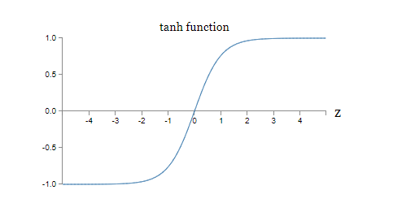

## CHAPTER 1 Using neural nets to recognize handwritten digits

### 1.Perceptrons

A perceptron takes several binary inputs,$x1,x2,…$ and produces a single **binary output**


### 2.Sigmoid neurons

The sigmoid neuron has inputs, $x1,x2,… $But instead of being just 0 or 1, these inputs can also take on any values *between* 0 and 1. But the output is not 0 or 1. Instead, it's $\sigma (w⋅x+b)$, where σσ is called the sigmoid function ,and is defined by:
$$
\begin{array}{cc}
  \sigma(z) \equiv \frac{1}{1+e^{-z}}
\end{array}
$$
To put it all a little more explicitly, the output of a sigmoid neuron with inputs $x_1,x_2,\ldots$ weights $w_1,w_2,\ldots$ and bias $b$ is
$$
\begin{array} {cc}
  \frac{1}{1+\exp(-\sum_j w_j x_j-b)}
\end{array}
$$

### 3. The architecture of neural networks


The term "hidden" perhaps sounds a little mysterious ,but it really means nothing more than **"not an input or an output"**.

### 4. Learning with gradient descent

To quantify how well we're achieving this goal we define a **cost function**
$$
\begin{array}{cc}  C(w,b) \equiv
  \frac{1}{2n} \sum_x \| y(x) - a\|^2
\end{array}
$$
Suppose in particular that CC is a function of mm variables,$v_1,\ldots,v_m$ Then the change $\Delta C$ in $C$ produced by a small change$\Delta v = (\Delta v_1, \ldots, \Delta v_m)^T$ is
$$
\begin{array}{cc}
  \Delta C \approx \nabla C \cdot \Delta v\end{array}
$$
where the gradient $\nabla C $ is the vector 
$$
\begin{array}{cc}aa
  \nabla C \equiv \left(\frac{\partial C}{\partial v_1}, \ldots, 
  \frac{\partial C}{\partial v_m}\right)^T\end{array}
$$
Just as for the two variable case, we can choose
$$
\begin{array}{cc}
  \Delta v = -\eta \nabla C\
\end{array}
$$
and we're guaranteed that our (approximate) expression  for $\Delta C$ will be negative. This gives us a way of following the gradient to a minimum, even when $C$ is a function of many variables, by repeatedly applying the update rule
$$
\begin{array}{cc}
  v \rightarrow v' = v-\eta \nabla C
\end{array}
$$

### 5.stochastic gradient descent

To make these ideas more precise, stochastic gradient descent works by randomly picking out a small number mm of randomly chosen training inputs. We'll label those random training inputs $X_1, X_2, \ldots, X_m$, and refer to them as a *mini-batch*. Provided the sample size mm is large enough we expect that the average value of the $\nabla C_{X_j}$ will be roughly equal to the average over all $\nabla C_{X}$, that is,
$$
\begin{array}{cc}
  \frac{\sum_{j=1}^m \nabla C_{X_{j}}}{m} \approx \frac{\sum_x \nabla C_x}{n} = \nabla C
\end{array}
$$
where the second sum is over the entire set of training data. Swapping sides we get
$$
\begin{array}{cc}
  \nabla C \approx \frac{1}{m} \sum_{j=1}^m \nabla C_{X_{j}}
\end{array}
$$


confirming that we can estimate the overall gradient by computing gradients just for the randomly chosen mini-batch.


To connect this explicitly to learning in neural networks, suppose $w_k $and $b_l$ denote the weights and biases in our neural network. Then stochastic gradient descent works by picking out a randomly chosen mini-batch of training inputs, and training with those,
$$
\begin{array}{cc} 
  w_k  \rightarrow  w_k' = w_k-\frac{\eta}{m} \sum_j \frac{\partial C_{X_j}}{\partial w_k}\\
  b_l  \rightarrow  b_l' = b_l-\frac{\eta}{m}
  \sum_j \frac{\partial C_{X_j}}{\partial b_l}
\end{array}
$$

## CHAPTER 2 How the backpropagation algorithm works

### 1. a fast matrix-based approach to computing the output from a neural network


With these notations, the activation $a^{l}_j$ of the $ j^{th}$ neuron in the $l^{th}$ layer is related to the activations in the $(l−1)^{th}$ layer by the equation
$$
\begin{array}{cc} 
  a^{l}_j = \sigma\left( \sum_k w^{l}_{jk} a^{l-1}_k + b^l_j \right)
\end{array}
$$
With these notations in mind, Equation can be rewritten in the beautiful and compact vectorized form
$$
\begin{array}{cc} 
  a^{l} = \sigma(w^l a^{l-1}+b^l)
\end{array}
$$

### 2.The two assumptions we need about the cost function

1. The first assumption we need is that the cost function can be written as an average $C = \frac{1}{n} \sum_x C_x$ over cost functions $C_x$ for individual training examples, $x$. This is the case for the quadratic cost function, where the cost for a single training example is $C_x = \frac{1}{2} \|y-a^L \|^2$

2. The second assumption we make about the cost is that it can be written as a function of the outputs from the neural network


For example, the quadratic cost function satisfies this requirement, since the quadratic cost for a single training example a$x$ may be written as
$$
\begin{array}{cc}
  C = \frac{1}{2} \|y-a^L\|^2 = \frac{1}{2} \sum_j (y_j-a^L_j)^2
\end{array}
$$

### 3.The Hadamard product, $s \odot t$

 Then we use $s \odot t$ to denote the *elementwise* product of the two vectors. Thus the components of $s \odot t$ are just $(s \odot t)_j=s_jt_j$. As an example
$$
\begin{array}{cc}
\left[\begin{array}{c} 1 \\ 2 \end{array}\right] 
  \odot \left[\begin{array}{c} 3 \\ 4\end{array} \right]
= \left[ \begin{array}{c} 1 * 3 \\ 2 * 4 \end{array} \right]
= \left[ \begin{array}{c} 3 \\ 8 \end{array} \right].
\end{array}
$$

### 4. The four fundamental equations behind backpropagation


$\begin{array}{cc}   \delta^l_j \equiv \frac{\partial C}{\partial z^l_j}=\frac{\partial C}{\partial a^L_j} \sigma'(z^L_j)\end{array}$


### 5.The backpropagation algorithm

1. **Input $x$:** Set the corresponding activation $a^1$ for the input layer.

2. **Feedforward:** For each $l = 2, 3, \ldots, L$ compute $z^{l} = w^l a^{l-1}+b^l$ and $a^{l} = \sigma(z^{l})$

3. **Output error $\delta ^L$:** Compute the vector $\delta^{L}  = \nabla_a C \odot \sigma'(z^L)$

4. **Backpropagate the error:** For each $l = L-1, L-2,  \ldots, 2$ compute $\delta^{l} = ((w^{l+1})^T \delta^{l+1}) \odot  \sigma'(z^{l})$.

5. **Output:** The gradient of the cost function is given by $\frac{\partial C}{\partial w^l_{jk}} = a^{l-1}_k \delta^l_j$ and  $\frac{\partial C}{\partial b^l_j} = \delta^l_j$


## CHAPTER 3 Improving the way neural networks learn

### 1. The cross-entropy cost function（交叉熵代价函数）


We define the cross-entropy cost function for this neuron by
$$
\begin{array}{cc} 
  C = -\frac{1}{n} \sum_x \left[y \ln a + (1-y ) \ln (1-a) \right],
\end{array}
$$
We substitute $a = \sigma(z)$ into, and apply the chain rule twice, obtaining:
$$
\begin{array}{cc}
  \frac{\partial C}{\partial w_j} & = & -\frac{1}{n} \sum_x \left(
    \frac{y }{\sigma(z)} -\frac{(1-y)}{1-\sigma(z)} \right)
  \frac{\partial \sigma}{\partial w_j} \\
 & = & -\frac{1}{n} \sum_x \left( 
    \frac{y}{\sigma(z)} 
    -\frac{(1-y)}{1-\sigma(z)} \right)\sigma'(z) x_j.
\end{array}
$$
Putting everything over a common denominator and simplifying this becomes:
$$
\begin{array}{cc}
  \frac{\partial C}{\partial w_j} & = & \frac{1}{n}
  \sum_x \frac{\sigma'(z) x_j}{\sigma(z) (1-\sigma(z))}
  (\sigma(z)-y).
\end{array}
$$

$$
\sigma'(z) =
\sigma(z)(1-\sigma(z))
$$

$$
\begin{array}{cc} 
  \frac{\partial C}{\partial w_j} =  \frac{1}{n} \sum_x x_j(\sigma(z)-y).
\end{array}
$$

In a similar way, we can compute the partial derivative for the bias. 
$$
\begin{array}{cc} 
  \frac{\partial C}{\partial b} = \frac{1}{n} \sum_x (\sigma(z)-y).
\end{array}
$$
The cross-entropy to many-neuron multi-layer networks

In particular, suppose $y = y_1, y_2, \ldots$are the desired values at the output neurons, i .e., the neurons in the final layer, while  $a^L_1, a^L_2, \ldots$  are the actual output values. Then we define the cross-entropy by
$$
\begin{array}{cc}  C = -\frac{1}{n} \sum_x
  \sum_j \left[y_j \ln a^L_j + (1-y_j) \ln (1-a^L_j) \right].
\end{array}
$$
**Problems**

- **Many-layer multi-neuron networks** 
  $$
  \begin{array}{cc} 
        \frac{\partial C}{\partial w^L_{jk}} & = & \frac{1}{n} \sum_x 
        a^{L-1}_k  (a^L_j-y_j)
  \end{array}
  $$
  
- **Using the quadratic cost when we have linear neurons in the output layer** 

$$
\begin{array}{cc}
      \frac{\partial C}{\partial w^L_{jk}} & = & \frac{1}{n} \sum_x 
      a^{L-1}_k  (a^L_j-y_j) \\
      \frac{\partial C}{\partial b^L_{j}} & = & \frac{1}{n} \sum_x 
      (a^L_j-y_j).
\end{array}
$$

This shows that if the output neurons are linear neurons then the quadratic cost will not give rise to any problems with a learning slowdown. In this case the quadratic cost is, in fact, an appropriate cost function to use.


### 2. softmax plus log-likelihood 

$$
\begin{array}{cc} 
  a^L_j = \frac{e^{z^L_j}}{\sum_k e^{z^L_k}},
\end{array}
$$

$$
\begin{array}{cc}
  C \equiv -\ln a^L_y.
\end{array}
$$

softmax plus log-likelihood is worth using whenever you want to interpret the output activations as **probabilities**

### 3. Overfitting and regularization

#### Overfitting

When that happens the model will work well for the existing data, but will fail to generalize to new situations. The true test of a model is its ability to make predictions in situations it hasn't been exposed to before.

#### Regularization

- L2 regularization
  $$
   \begin{array}{cc}  C &= &C_0 + \frac{\lambda}{2n} \sum_w w^2,\\
      w \rightarrow w' &= &w\left(1 - \frac{\eta \lambda}{n} \right)
      - \eta \frac{\partial C_0}{\partial w}.
   \end{array}
  $$
  


  Intuitively, the effect of regularization is to make it so the network prefers to learn small weights, all other things being equal.

- L1 regularization
  $$
    \begin{array}{cc}
    C & = & C_0 + \frac{\lambda}{n} \sum_w |w|\\
    \frac{\partial C}{\partial w}& = &\frac{\partial C_0}{\partial w} + \frac{\lambda}{n} \, {\rm sgn}(w)\\
     w \rightarrow w' &=&
      w-\frac{\eta \lambda}{n} {sgn}(w) - \eta \frac{\partial
        C_0}{\partial w}
  \end{array}
  $$
  

  In L1 regularization, the weights shrink by a constant amount toward $0$ . In L2 regularization, the weights shrink by an amount which is proportional to $w$. 

- Dropout

- Artificially expanding the training data

- An aside on big data and what it means to compare classification accuracies


### 4.Weight initialization 

Then we shall initialize those weights as Gaussian random variables with mean $0$ and standard deviation $1/\sqrt{n_{\rm in}}$

We'll continue to choose the bias as a Gaussian with mean $0$ and standard deviation $1$.

### 5. How to choose a neural network's hyper-parameters?

- **Broad strategy**
- **Use early stopping to determine the number of training epochs**
- **Learning rate schedule**

- **Automated techniques**

### 6.Other techniques

1. **Variations on stochastic gradient descent**
   
   - Hessian technique
   
$$
   \begin{array}{cc}
     C(w+\Delta w) & = & C(w) + \sum_j \frac{\partial C}{\partial w_j} \Delta w_j
    \\ & & + \frac{1}{2} \sum_{jk} \Delta w_j \frac{\partial^2 C}{\partial w_j
       \partial w_k} \Delta w_k + \ldots
   \end{array}
$$

$$
   \begin{array}{cc}
     C(w+\Delta w) = C(w) + \nabla C \cdot \Delta w +
     \frac{1}{2} \Delta w^T H \Delta w + \ldots,
   \end{array}
$$

   Using calculus we can show that the expression on the right-hand side can be minimized by choosing
$$
   \begin{array}{cc}
     \Delta w = -H^{-1} \nabla C.
   \tag{106}\end{array}
$$
   That suggests a possible algorithm for minimizing the cost:

   - Choose a starting point, $w$.
   
   - Update $w$ to a new point $w' = w-H^{-1} \nabla C$ where the Hessian $H$ and $\nabla C$ are computed at $w$.
   
   - Update $w'$ to a new point $w{'}{'} = w'-H'^{-1} \nabla' C$, where the Hessian $H′$ and  $\nabla' C$are computed at $w′$.

   We do this by repeatedly changing $w$ by an amount $\Delta w = -\eta H^{-1} \nabla C$, where $\eta$ is known as the *learning rate*.

   

   - Momentum-based gradient descent
   
     

2. **Other models of artificial neuron**

   - tanh
   $$
   \begin{array}{cc}
          \tanh(w \cdot x+b), 
        \tag{109}\end{array}
   $$

   $$
    \begin{array}{cc}
      \tanh(z) \equiv \frac{e^z-e^{-z}}{e^z+e^{-z}}.
    \tag{110}\end{array}
   $$




   - rectified linear neuron or rectified linear unit (ReLU)


## CHAPTER 5 Why are deep neural networks hard to train?

### 1. The vanishing gradient problem(梯度消失)

### 2. The exploding gradient problem


## CHAPTER 6 Deep learning

### 1. Introducing convolutional networks

Convolutional neural networks use three basic ideas: *local receptive fields*, *shared weights*, and *pooling*. 

- Local receptive fields

- Shared weights and biases

  For this reason, we sometimes call the map from the input layer to the hidden layer a *feature map*

  We call the weights defining the feature map the **shared weights**. And we call the bias defining the feature map in this way **the shared bias.** The shared weights and bias are often said to define a ***kernel* or *filter*.**

- Pooling layers

  - Max-pooling
  - L2 pooling

  What the pooling layers do is **simplify the information in the outpu**t from the convolutional layer.


- Putting it all together


The final layer of connections in the network is a fully-connected layer. That is, this layer connects every neuron from the max-pooled layer to every one of the 10 output neurons.

### 2.Convolutional neural networks in practice

```python
# - network3.py example:
import network3
from network3 import Network, ConvPoolLayer, FullyConnectedLayer, SoftmaxLayer # softmax plus log-likelihood cost is more common in modern image classification networks.

# read data:
training_data, validation_data, test_data = network3.load_data_shared()
# mini-batch size:
mini_batch_size = 10
net = Network([
    FullyConnectedLayer(n_in=784, n_out=100),
    SoftmaxLayer(n_in=100, n_out=10)], mini_batch_size)
net.SGD(training_data, 10, mini_batch_size, 0.1, validation_data, test_data)
```

- two differences 
  - we regularized the earlier network, to help reduce the effects of overfitting. Regularizing the current network does improve the accuracies, but the gain is only small, and so we'll hold off worrying about regularization until later.
  -  Second, while the final layer in the earlier network used sigmoid activations and the cross-entropy cost function, the current network uses a softmax final layer, and the log-likelihood cost function. 


#### inserting a convolutional layer


```python
net = Network([
    ConvPoolLayer(image_shape=(mini_batch_size, 1, 28, 28),
                  filter_shape=(20, 1, 5, 5),
                  poolsize=(2, 2)),
    FullyConnectedLayer(n_in=20*12*12, n_out=100),
    SoftmaxLayer(n_in=100, n_out=10)], mini_batch_size)
net.SGD(training_data, 60, mini_batch_size, 0.1, validation_data, test_data)
```

#### inserting a second convolutional-pooling layer

``` python
net = Network([
    ConvPoolLayer(image_shape=(mini_batch_size, 1, 28, 28),
                  filter_shape=(20, 1, 5, 5),
                  poolsize=(2, 2)),
    ConvPoolLayer(image_shape=(mini_batch_size, 20, 12, 12),
                  filter_shape=(40, 20, 5, 5),
                  poolsize=(2, 2)),
    FullyConnectedLayer(n_in=40*4*4, n_out=100),
    SoftmaxLayer(n_in=100, n_out=10)], mini_batch_size)
net.SGD(training_data, 60, mini_batch_size, 0.1, validation_data, test_data)
'''
```

1. In fact, you can think of the second convolutional-pooling layer as having as input 12×12 "images", whose "pixels" represent the presence (or absence) of particular localized features in the original input image.

2. It's as though we've got 20 separate images input to the convolutional-pooling layer, not a single image, as was the case for the first convolutional-pooling layer. How should neurons in the second convolutional-pooling layer respond to these multiple input images? In fact, we'll allow each neuron in this layer to learn from all 20×5×5 input neurons in its local receptive field.

####  Why are we able to train?

1. Using convolutional layers greatly reduces the number of parameters in those layers, making the learning problem much easier
2. Using more powerful regularization techniques (notably dropout and convolutional layers) to reduce overfitting
3. Using rectified linear units instead of sigmoid neurons, to speed up training - empirically, often by a factor of 3-5
4. Using GPUs and being willing to train for a long period of time


#### the softmax layer

Rather than do that, I shall initialize all the weights and biases to be 0. This is a rather ad hoc procedure, but works well enough in practice.
